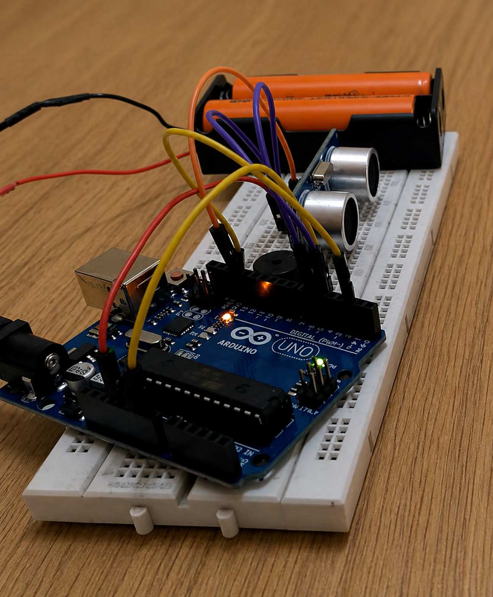

# 🚨 Intruder Alarm System using Ultrasonic Sensor (Arduino)

The **Intruder Alarm System** is a simple yet effective security solution built using an ultrasonic sensor and Arduino.
It detects the presence of an object (intruder) within a predefined distance and triggers an alarm using a buzzer.

---

## 🎯 Objectives

* To design a basic intrusion detection system
* To measure distance using an ultrasonic sensor (HC-SR04)
* To trigger an alert when an object enters a restricted zone
* To implement real-time monitoring using Arduino

---

## ⚙️ Components Used

| Component                 | Description                         |
| ------------------------- | ----------------------------------- |
| Arduino Uno               | Microcontroller for processing      |
| HC-SR04 Ultrasonic Sensor | Measures distance using sound waves |
| Buzzer                    | Generates alert sound               |
| Breadboard                | Circuit prototyping                 |
| Jumper Wires              | Electrical connections              |

---

## 🔧 Working Principle

The system operates based on **ultrasonic distance measurement**:

1. The ultrasonic sensor emits high-frequency sound waves.
2. These waves reflect off nearby objects and return as echoes.
3. The Arduino calculates the time taken for the echo to return.
4. Distance is computed using the speed of sound.
5. If the measured distance is less than a predefined threshold, the buzzer is activated.

---

## 📐 Distance Calculation Formula

## Distance = (Time × Speed of Sound) / 2

Where:

* Speed of sound ≈ **0.0343 cm/µs**
* Division by 2 accounts for round-trip travel

---

## 🔄 System Flow

Ultrasonic Sensor → Echo Time Measurement → Distance Calculation → Condition Check → Buzzer Activation

---

## 💻 Arduino Code

```cpp
#define echo 4
#define trig 3
#define outC 8 // Buzzer

float duration;
float distance;
const int intruderDistance = 10;

void setup() {
  pinMode(trig, OUTPUT);
  pinMode(echo, INPUT);
  pinMode(outC, OUTPUT);
  digitalWrite(outC, LOW);
  Serial.begin(9600);
}

void loop() {
  time_Measurement();
  distance = (float)duration * (0.0343) / 2;
  Serial.println(distance);
  alarm_condition();
}

void time_Measurement() {
  digitalWrite(trig, LOW);
  delayMicroseconds(2);

  digitalWrite(trig, HIGH);
  delayMicroseconds(10);
  digitalWrite(trig, LOW);

  duration = pulseIn(echo, HIGH);
}

void alarm_condition() {
  if(distance <= intruderDistance) {
    analogWrite(outC, 200);
  } else {
    analogWrite(outC, 0);
  }
}
```

---

## 🔌 Circuit Diagram


---

## 📸 Prototype



---

## 📊 Features

* Real-time intrusion detection
* Simple and low-cost implementation
* Easy to build and understand
* Expandable for advanced systems

---

## ✅ Applications

* Home security systems
* Office surveillance
* Restricted area monitoring
* Smart automation systems

---

## ⚠️ Limitations

* Limited detection range
* Sensitive to environmental conditions
* May produce false alarms
* No remote alert system

---

## 🚀 Future Enhancements

* 📱 Mobile notification using IoT (ESP32/WiFi)
* 📷 Camera integration for image capture
* 📡 GSM-based SMS alert system
* 🔐 Integration with smart locks
* 🤖 AI-based intrusion detection

---

## 📚 Learning Outcomes

* Understanding ultrasonic sensing
* Working with Arduino I/O pins
* Real-time embedded programming
* Sensor interfacing and signal processing

---

## 📚 Conclusion

This project successfully demonstrates a basic intruder detection system using ultrasonic sensing.
It highlights how simple electronic components can be combined to create practical and scalable security solutions.

---

## 👩‍💻 Author

**Farhana N S**
